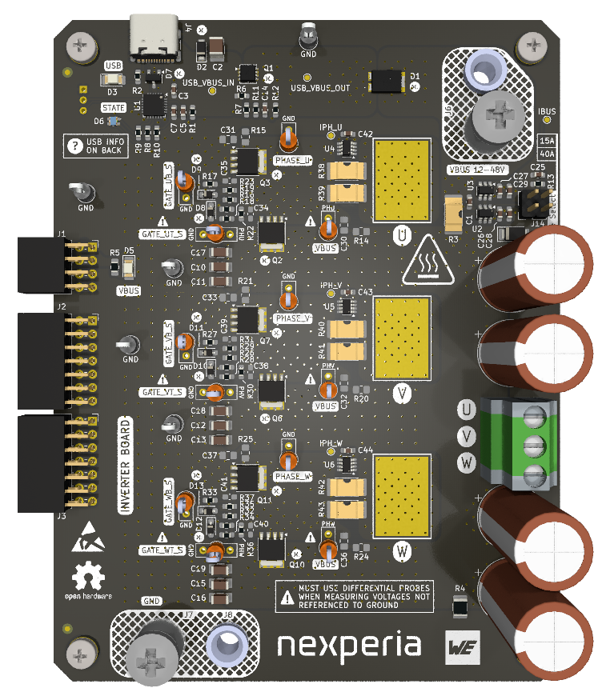

<picture align="center">
  <source media="(prefers-color-scheme: dark)" srcset="https://raw.githubusercontent.com/Nexperia/NEVB-MTR1-I56-1/refs/heads/main/images/nexperia_logo_white.svg">
  
</picture>

-----------------
# NEVB-MTR1-I56-1: 3-Phase Inverter Board Hardware Design Files

 

## Introduction

This repository contains the hardware design files for the NEVB-MTR1-I56-1 3-Phase Inverter Board, a key component of Nexperia's Motor Evaluation Kit NEVB-MTR1-KIT1. The inverter board serves as the main powerstage for driving the motor, interfacing with the Motor Controller Board.

The NEVB-MTR1-KIT1 evaluation kit includes:

- **Motor Controller Board (NEVB-MTR1-C-1)**: The central unit for motor control operations.
- **3-Phase Inverter Board (NEVB-MTR1-I56-1)**: The main powerstage for driving the motor (this repository).
- **Leonardo R3 Development Board**: Acts as the core microcontroller platform for the system.
- **3-Phase BLDC Motor with Hall Sensors**: The motor that is directly controlled by the system.
- Additional screws, plugs, and tools necessary for setup and operation.

## Board View

## Bill of Materials

An interactive Bill of Materials (iBOM) is available online at [https://nexperia.github.io/NEVB-MTR1-I56-1/ibom.html](https://nexperia.github.io/NEVB-MTR1-I56-1/ibom.html) or locally in the `bom/` directory (`bom/ibom.html`). The iBOM provides an interactive view of component placement, reference designators, and sourcing information. The BOM is also available in CSV format at `bom/nevb_mtr1_i56_1.csv`.

## Manufacturing Files

Gerber files for PCB manufacturing are located in the `gerbers/` directory.

## Design Software

This board was designed using [KiCad](https://www.kicad.org/) EDA software (version 9.0 or newer recommended).

To open and edit the design:

1. Install KiCad from [https://www.kicad.org/download/](https://www.kicad.org/download/)
2. Open the project file: `nevb_mtr1_i56_1.kicad_pro`

## Related Repositories

- **Firmware**: [NEVC-MTR1-t01](https://github.com/Nexperia/NEVC-MTR1-t01) - Trapezoidal control firmware for the evaluation kit
- **Motor Controller Board** [NEVB-MTR1-C-1](https://github.com/Nexperia/NEVB-MTR1-C-1) - Design files for the motor controller board

## Safety Precautions

When working with these hardware designs, exercise caution with high-voltage components and follow proper ESD, assembly, and testing procedures.

## Contributing

Contributions to improve the hardware design are welcome. To contribute:

- Fork the repository.
- Create a new branch for your feature or fix.
- Commit your changes with clear documentation.
- Push to your branch and submit a pull request.

## License

This project is licensed under the MIT/X Consortium License, a permissive free software license. For more details on the MIT/X Consortium License, please refer to the LICENSE file included in this repository.

## Schematics

The inverter board design is organized into hierarchical schematic sheets:

